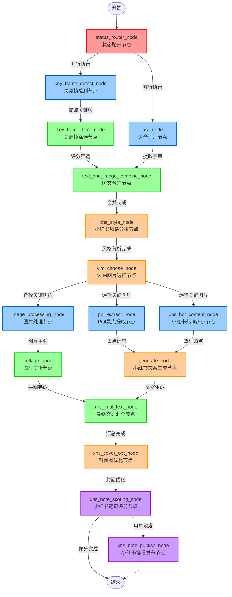

# 1. 总体流程

# 2. 各模块

## 2.1 关键帧提取

**功能**：从视频中提取指定数量的关键帧

**流程**：`读取视频文件 → 按采样率读取帧 → 提取HSV颜色直方图特征 → MiniBatchKMeans聚类 → 选出最接近簇中心的关键帧 → 保存`

**工具**：

- scenedetect（`pip install scenedetect`）：自动识别视频中的场景切换点（镜头切换），将视频按场景分段
    - 场景检测和关键帧提取
- cv2（`pip install opencv-python-headless`）：OpenCV 的 Python 接口
    - 视频帧读取（`cv2.VideoCapture`）
    - 从视频帧中提取颜色特征（HSV 颜色直方图）
- sklearn（`pip install scikit-learn`）：
    - K-Means 聚类算法（MiniBatchKMeans）：对提取的关键帧进行聚类，选出最具代表性的关键帧

## 2.2 关键帧筛选

**功能**：对关键帧进行质量评分和筛选，过滤出符合质量标准的关键帧

**流程**：`对所有关键帧并发调用图片质量评分API → 返回合格关键帧列表`

**工具**：

- 评估用户生成内容(UGC)照片质量接口：https://api.everypixel.com/v1/quality_ugc

## 2.3 语音转文本(提取字幕)

ASR(Automatic Speech Recognition: 自动语音识别)

**功能**：从视频中提取音频并进行语音识别，将语音转换为带时间戳的文本

**流程**：`使用ffmpeg从视频中提取音频 → 调用火山引擎ASR服务进行语音识别`

**工具**：

- ffmpeg
- 字节ASR接口：https://openspeech-direct.zijieapi.com/api/v3/auc/bigmodel/submit

## 2.4 关键帧和ASR文本内容合并

**功能**：将筛选后的关键帧与ASR语音识别文本进行时间对齐，生成包含图片、文本、情感等信息的叙事元素列表

**流程**：`获取关键帧列表和ASR文本块 → 遍历每个关键帧解析时间戳 → 匹配时间区间内的ASR文本 → 组装叙事元素（图片URL、文本、情感、时间戳） → 按时间排序 → 返回合并结果`

## 2.5 小红书风格分析

**功能**：从原视频文案中分析写作风格特征（语言风格、内容特点、情感基调、小红书适配性）

**流程**：`获取ASR后的视频文案 → 调用LLM(gpt-5-chat)进行风格分析`

## 2.6 使用VLM选择图片

**功能**：根据视频的字幕(ASR结果)、关键帧图片、叙事逻辑，选择最关键的图片，并提供内容标签、关键词和文案建议。

**流程**：`获取视频字幕(ASR结果)和图文合并后的视频帧图片列表 → 调用VLM(gpt-5-chat)选择最关键的图片（建议选择15-20张），并提供内容标签、关键词和文案建议`

## 2.7 图片增强

**功能**：对VLM选择的图片进行图片增强、搜索替换

**流程**：并发处理vlm选择的图片 → 对每张图片依次执行：图像质量增强(gemini-3-pro-image-preview)、图像搜索替换(根据关键词网络搜素图片，根据评分选择最近图片)

**工具**：

- 去水印接口（暂时没用，使用vlm增强时去除水印）：https://techsz.aoscdn.com/api/tasks/visual/external/watermark-remove

## 2.8 图片拼接

**功能**：将处理后的关键帧图片和POI图片通过AI智能分析生成多张拼图

**流程**：`LLM(gpt-5-chat)生成拼图方案 → 并发处理所有拼图任务 → 过滤结果（最多保留9张）`

**工具**：

- PIL（`pip install pillow`）：Python Imaging Library 是 Python 中常用的图像处理库，原始的 PIL 项目已经停止维护，Pillow 是它的一个活跃分支。

## 2.9 POI景点提取

**功能**：从视频字幕中提取景点信息，通过LLM识别景点关键词后调用POI接口获取详细信息并返回结构化景点列表

**流程**：`获取视频字幕(ASR结果) → LLM(gpt-5-chat)提取景点关键词和城市 -> POI挂靠 -> 查询挂靠后的标准POI的详细信息`

## 2.10 匹配小红书热词/热点

**功能**：匹配视频内容相关的小红书热词和热点榜单

**流程**：`基于视频字幕(ASR结果)向量(m3e-base)检索热词库 → 调用Tikhub接口获取小红书实时热榜`

**工具**：

- 获取小红书热榜数据接口：https://api.tikhub.io/api/v1/xiaohongshu/web_v2/fetch_hot_list

## 2.11 小红书文案生成

**功能**：根据VLM选择的关键帧、POI景点信息和小红书热点数据，调用LLM生成文案

**流程**：`组装上下文 → 调用LLM(gpt-5-chat)生成文案`

## 2.12 图文汇总成最终文章

**功能**：汇总生成的小红书文案与拼图图片，组装成最终可发布的笔记内容

**流程**：根据小红书文案(包含标题、正文、话题标签)和拼图结果构建最终笔记对象

## 2.13 封面图优化

**功能**：对小红书笔记的第一张图片进行风格优化

**流程**：`调用图生图服务(google/gemini-3-pro-image-preview)增强图片`

## 2.14 对最终笔记进行评分

**功能**：对生成的小红书帖子进行多维度VLM评分，包括图片质量和文案质量的综合评估

**流程**：`组装评分上下文 → 调用VLM(gpt-5-chat)进行评分 `

## 2.15 笔记发布

**功能**：通过MCP连接小红书服务，使用ReAct Agent调用LLM自动发布小红书笔记

